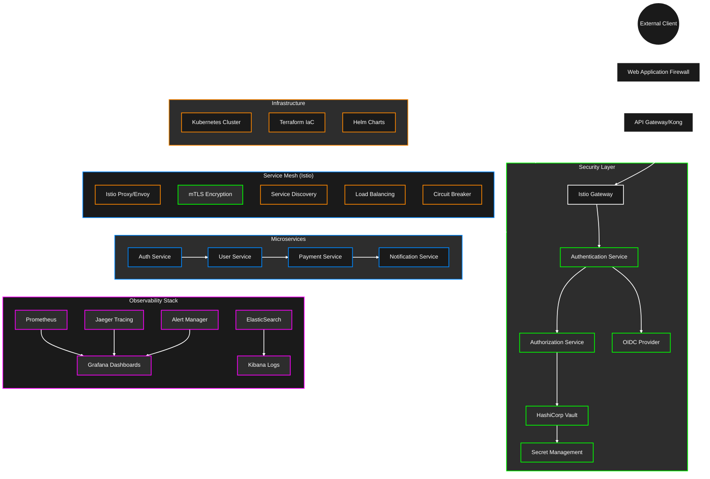

# Secure Microservices Platform

[](https://opensource.org/licenses/MIT)
[](docs/testing.md)
[](docs/security.md)
[](docs/CONTRIBUTING.md)

A production-grade secure microservices platform implementing Zero-Trust Architecture principles with modern security practices. This platform provides enterprise-level security features while maintaining scalability and observability.

## 🌟 Key Features

- **Zero-Trust Architecture**
  - Service Mesh (Istio) with mTLS enforcement
  - Identity-based security policies
  - Network policy enforcement
  - Service-to-service authentication

- **Security & Compliance**
  - Automated secret management with HashiCorp Vault
  - TLS encryption for all services
  - Security policy as code
  - Compliance reporting and auditing
  - Container security scanning

- **Observability & Monitoring**
  - Real-time security monitoring
  - Distributed tracing with Jaeger
  - Metrics collection with Prometheus
  - Visualization with Grafana
  - Automated alerting system

- **Infrastructure as Code**
  - Terraform-based infrastructure
  - GitOps-ready configuration
  - Infrastructure testing
  - Automated deployment pipelines

## 🏗️ Architecture



## 🚀 Quick Start

### Prerequisites

- Docker Desktop with Kubernetes enabled
- Helm v3.x
- kubectl
- Terraform >= 1.0
- istioctl
- vault CLI

### Installation

1. Clone the repository:
```bash
git clone https://github.com/yourusername/secure-microservices-platform.git
cd secure-microservices-platform
```

2. Install dependencies:
```bash
sudo ./scripts/setup.sh
```

3. Deploy the infrastructure:
```bash
cd infrastructure
terraform init
terraform apply
```

4. Verify the deployment:
```bash
kubectl get pods -A
```

## 🔒 Security Features

### Zero-Trust Implementation
- Every service requires authentication
- All traffic is encrypted with mTLS
- Network policies restrict unauthorized access
- Regular security scanning and updates

### Secret Management
- Automated secret rotation
- Encrypted storage using HashiCorp Vault
- Access audit logging
- Least privilege access control

### Compliance & Auditing
- Detailed audit trails
- Compliance reporting
- Security metrics collection
- Regular vulnerability assessments

## 📊 Monitoring & Alerting

### Real-time Monitoring
- Service health metrics
- Security event tracking
- Performance monitoring
- Resource utilization

### Alerting System
- Customizable alert thresholds
- Multiple notification channels
- Alert aggregation and deduplication
- Incident response automation

## 🧪 Testing

### Infrastructure Testing
```bash
cd tests
go test -v ./...
```

### Security Testing
```bash
./scripts/security-scan.sh
```

## 📚 Documentation

- [Detailed Setup Guide](docs/setup.md)
- [Security Architecture](docs/security.md)
- [Monitoring Guide](docs/monitoring.md)
- [Troubleshooting](docs/troubleshooting.md)
- [Contributing Guidelines](docs/CONTRIBUTING.md)

## 🤝 Contributing

We welcome contributions! Please read our [Contributing Guidelines](docs/CONTRIBUTING.md) for details on how to submit pull requests, report issues, and contribute to the project.

## 📝 License

This project is licensed under the MIT License - see the [LICENSE](LICENSE) file for details.

## 🏢 Enterprise Support

For enterprise support and custom implementations, please contact: support@yourdomain.com

## EKS Cluster Configuration
- Cluster Name: secure-microservices-cluster
- Region: us-west-2 (AWS Oregon)
- AWS Account: 730335539127
- Kubernetes Version: v1.27.16-eks

### Connect to Cluster
```bash
# Important: Make sure to use us-west-2 region
aws eks update-kubeconfig --name secure-microservices-cluster --region us-west-2
```

### Verify Connection
```bash
# Check nodes
kubectl get nodes

# Expected output:
NAME                                       STATUS   ROLES    AGE   VERSION
ip-10-0-1-208.us-west-2.compute.internal   Ready    <none>   9h    v1.27.16-eks-aeac579
ip-10-0-2-47.us-west-2.compute.internal    Ready    <none>   9h    v1.27.16-eks-aeac579
ip-10-0-3-122.us-west-2.compute.internal   Ready    <none>   9h    v1.27.16-eks-aeac579
```

## HashiCorp Vault Configuration
- Namespace: vault
- Status: Initialized and Unsealed
- Authentication: Kubernetes Auth Method Enabled
- Secrets Engine: KV-v2 enabled at path 'secret/'

### Important Vault Information
⚠️ **Important**: The root token and unseal keys have been securely stored in a separate location. Contact the system administrator for access.

### Vault Policies
- App Policy: Read access to 'secret/data/app/*'

### Kubernetes Integration
- Service Account: vault-auth
- ClusterRoleBinding: vault-auth-binding
- Authentication Role: app (bound to all service accounts, 1h TTL)

### Test Secret
```bash
# Read test secret
kubectl exec vault-0 -n vault -- sh -c 'VAULT_ADDR=http://127.0.0.1:8200 VAULT_TOKEN=<your-vault-token> vault kv get secret/app/test'
```

## Infrastructure Components
### Nodes
```
NAME                                       STATUS   ROLES    AGE   VERSION
ip-10-0-1-208.us-west-2.compute.internal   Ready    <none>   9h    v1.27.16-eks-aeac579
ip-10-0-2-47.us-west-2.compute.internal    Ready    <none>   9h    v1.27.16-eks-aeac579
ip-10-0-3-122.us-west-2.compute.internal   Ready    <none>   9h    v1.27.16-eks-aeac579
```

## Security Notice
⚠️ **Important**: All sensitive credentials and keys should be stored securely in a production environment. Consider using a secret manager or secure vault for these credentials.

## Troubleshooting
If you encounter connection issues:
1. Verify you're using the correct region (us-west-2)
2. Ensure your AWS credentials are properly configured
3. Run `aws sts get-caller-identity` to verify your AWS identity
4. Check your VPN/network connectivity to AWS us-west-2 region 